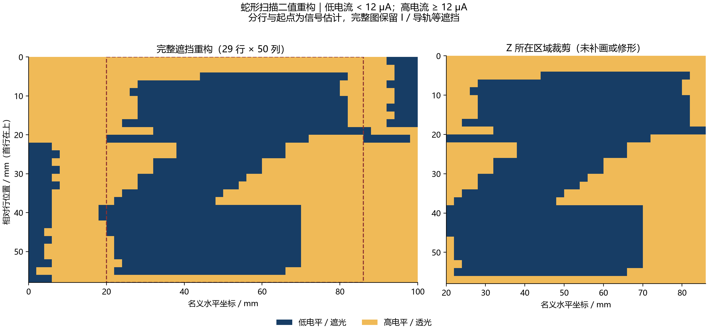
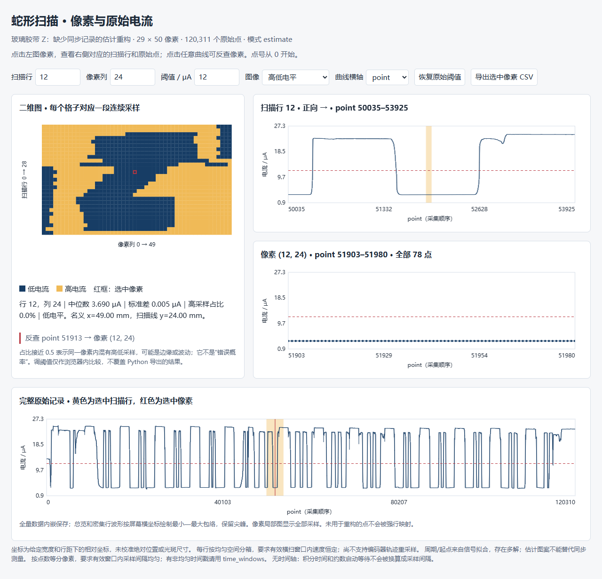

# 蛇形扫描电流图像重构

将源表连续电流记录重排为二维图，保存每个像素对应的全部原始采样。适合平移台透射成像、遮挡扫描和教学演示。提供 Python 例程、参数向导、实测示例、合成验证及无需联网的双向联动查看器。

这是**单通道电流空间重构**，尚不计算 Stokes 参数、偏振度或偏振角。电机端可配合 [STM32 + ZDT 双轴平移台控制例程](https://github.com/uestczhaoyan-gif/stm32-zdt-xy-stage) 使用；本项目离线处理测量数据，不直接驱动电机。



蓝色表示低电流，黄色表示高电流。示例中的分行、起点和换行占时是估计，不能据此作精确尺寸测量；图中的 I、导轨和胶带倾斜都可能是真实遮挡。

## 第一次打开项目

**v1.1.0 已包含完整实测原始数据、参数、代码和生成结果。** 可以先下载 [完整项目包](https://github.com/uestczhaoyan-gif/snake-scan-reconstruction/releases/latest)，解压后双击 `open_results.cmd`，或直接用浏览器打开 `results/z_tape/viewer.html`。查看现成结果不需要安装 Python，也不需要联网。

- [从哪里开始读、怎样看曲线和对应表](docs/reading-guide.md)
- [实际测量要注意什么、需要保存哪些数据](docs/measurement.md)
- [实验参数记录模板](docs/experiment.template.json)
- [这次图案不规则的原因与证据](docs/artifacts.md)
- [已生成的全部结果及文件说明](results/README.md)

`examples/` 保存原始数据与重构配置，`results/` 保存本次发布时的完整结果；自己重新运行会生成 `outputs/`，便于对照而不覆盖发布快照。说明和数据均随仓库提供，使用 GitHub 的 Download ZIP 也能取得完整内容。

## 先运行自带示例

需要 Python 3.10 或更新版本。在项目根目录执行：

```bash
python -m pip install -r requirements.txt
python reconstruct.py run --config examples/z_tape/config.json --open
```

Windows 也可以双击 `run_example.cmd`。它优先使用本机 `D:\Anaconda\python.exe`，没有则使用 PATH 中的 Python。该脚本会重新生成 `outputs/z_tape` 的结果。

运行结束后打开 `outputs/z_tape/viewer.html`；无需重新计算时直接打开随项目附带的 `results/z_tape/viewer.html`。文件内嵌原始数据，无 CDN、无需启动服务、无需联网。可以复制给同学，用现代 Edge、Chrome 或 Firefox 打开。**GitHub 的文件预览不会执行交互图**，需要先下载，再用浏览器打开。



## 怎么把二维图与原始曲线对应起来

1. 点击左侧二维图的一个格子，或输入行号、列号。红框是选中像素。
2. 右上显示这一扫描行的原始曲线，黄色区间对应选中像素；箭头说明横扫方向。
3. 右下显示该像素**全部原始采样**、点号范围。中位数决定高低分类，红虚线是阈值。
4. 下方完整曲线标出当前行和像素。点击曲线可反查对应格子；启动、转向等未建图点会明确提示“未用于二维图”。
5. 切换到“高电流采样占比”找混合边缘，调阈值观察分类变化，或导出该像素的 CSV。浏览器调整不会覆盖 Python 结果；正式修改需改配置后重新运行。

索引都从 0 开始。`[a,b)` 包含 a、不包含 b；例如本例 `(7,41)` 对应 `current[30583:30660]`，共 77 点。该像素约 50.6% 的采样超过阈值，中位数 12.4 μA，适合练习检查混合边缘。原始曲线始终保持采集顺序，蛇形反向只改变像素位置和索引对应关系。

查看器总览采用屏幕像素内最小—最大包络保留尖峰；数据没有抽稀存储，局部像素图显示全部点。程序另保存完整、不滤波的 I–point 静态图。有有效时间戳或用户提供的已知采样间隔时，也可显示 I–t。

## 用自己的数据

先选重构方式：

| 模式 | 必须知道什么 | 适用情形 |
|---|---|---|
| `time_windows` | 每点时间戳，以及每行有效横扫开始/结束时间和方向 | 首选；支持非均匀采样，但横扫窗口内须匀速 |
| `index_windows` | 每行有效横扫首末点下标和方向 | 已有采样触发/行边界，且行内采样均匀 |
| `constant` | 每行周期点数、首个完整周期起点；必要时换行占比 | 行周期与采样间隔确实稳定 |
| `estimate` | 有重复结构的信号、周期搜索范围、用于拟合的点号范围 | 旧数据补救；依赖相邻行连续性，可能多解 |

所有模式还需输入：**数据路径、扫描宽度、行距、每行像素数**。阈值可固定，或填 `null` 使用 Otsu；自动阈值要求信号可分成两类，需要查看结果确认。

不需要提前知道总高度：有行窗口时由窗口数确定行数；周期模式只使用覆盖完整的周期。估计模式得出的行数不是硬件实际行数证明。

参数向导：

```bash
python reconstruct.py wizard --output local/config.json
python reconstruct.py run --config local/config.json --open
```

或者生成模板后填写：

```bash
python reconstruct.py init --mode time_windows --output local/config.json
```

模板内的 `null` 不是测量值。所有相对路径以**配置文件所在文件夹**为基准，建议把自己的数据放到被 Git 忽略的 `local/`。输出目录非空时程序会提示；确定需要更新才加 `--overwrite`，或改用新的输出目录。

标准数据 CSV（电流单位 A，时间单位秒）：

```csv
point,time_s,current_A
0,0.000,0.0000037
1,0.012,0.0000038
2,0.025,0.0000235
```

`point` 可省略；若有，必须为连续十进制整数。`time_s` 可省略，但不得用积分时间冒充采样间隔。旧的“两列 I(A)、点号”文本用 `input_format="legacy"`；只有八进制解释能恢复连续点号时才自动按八进制读取。

时间窗 CSV 示例（仅格式示意，必须替换为本次实测值）：

```csv
start_s,stop_s,direction
10.200,60.200,forward
61.900,111.900,reverse
```

时间窗应只含有效匀速横扫，排除加减速、垂直步进和等待。每行扫描范围相同、依次相隔一个行距；方向 `forward` 表示 x 从 0 到扫描宽度，`reverse` 相反。记录时间必须来自同一时钟或已经校正时钟偏移。详见 [参数与数据格式](docs/configuration.md)。

## 本例为什么有不规则像素

最主要的证据是分行敏感性：阈值从 12 μA 改到 8 或 16 μA，改变像素均少于 1%；每行周期只改约 0.2%，改变像素约 8.4%。因此，时间到位置的对齐值得优先核对。

1450 个像素中有 46 个高电流采样占比处于 20%～80%，存在混合边缘或波动；不是 46 个已知错误点。胶带倾斜、光斑覆盖边缘、2 mm 行距、导轨真实遮挡、转向停顿和采样开销都可能影响形状。环境光是可能因素，但这次数据没有暗场和同步对照，不能单独确认它的贡献。

完整说明、可点击核对的像素例子和敏感性方法见 [不规则像素分析](docs/artifacts.md)。

## 测量时优先保存

- **原始电流 + 每点时间戳 + 点号**，保留未滤波数据和仪器状态。
- **逐行运动记录**：行号、方向、有效横扫开始/结束、实际停止时刻；尽量记录反馈位置。
- **完整参数快照**：宽度、行距、速度、加速度、实际行数、起点与方向；源表型号、量程、积分设置及单位、滤波、自动归零、触发设置。
- **参考与环境记录**：暗场、透光参考、光源稳定性、光斑大小、样品方向照片、遮挡条件；偏振实验另存角度/通道和标定信息。

可直接照做的实验前/中/后清单、CSV 字段及 JSON 模板见 [测量与数据保存指南](docs/measurement.md)。

## 输出与扩展

`outputs/<实验>/` 保存：完整原始图、二值图、混合采样占比图、`viewer.html`、像素矩阵、双向对应 CSV、实际使用的行窗口、`reconstruction.npz` 和含数据 SHA256/库版本/参数的 `metadata.json`。全部原始点都保留，未用于图像的点用行列 `-1` 标记。

代码分层：

```text
snake_scan/
  core.py        信号读入兼容与恒定周期估计
  pipeline.py    数据校验、行窗口、按像素聚合
  report.py      PNG/SVG、CSV、NPZ 与离线图导出
  viewer.html    浏览器双向对应与阈值探索
  cli.py         命令行、模板与参数向导
examples/
  z_tape/        用户实测数据，缺少同步的估计例子
  synthetic/     有已知答案的非均匀时间戳例子
tests/           映射、时间窗、输入错误与示例验证
docs/            测量、分析、参数和扩展说明
results/         随项目发布的完整结果与 SHA256 清单
scripts/         维护者重建结果快照的脚本
```

安装为命令也可以：`python -m pip install -e .`，之后使用 `snake-scan run --config ...`。运行验证：

```bash
python -m unittest discover -s tests -v
python reconstruct.py run --config examples/synthetic/config.json
```

本例未按照片补画、去孤点或做形态学修形。阈值分类和空间分箱不能提高真实光学分辨率。编码器非匀速轨迹、缺失像素掩码、多通道偏振处理等扩展接口见 [开发说明](docs/development.md)。

代码及本仓库示例采用 [MIT 许可](LICENSE)。原始 Z 数据由 Felix Yann 提供，只作方法演示，无同步数据时不视为带精确坐标的标准答案。
