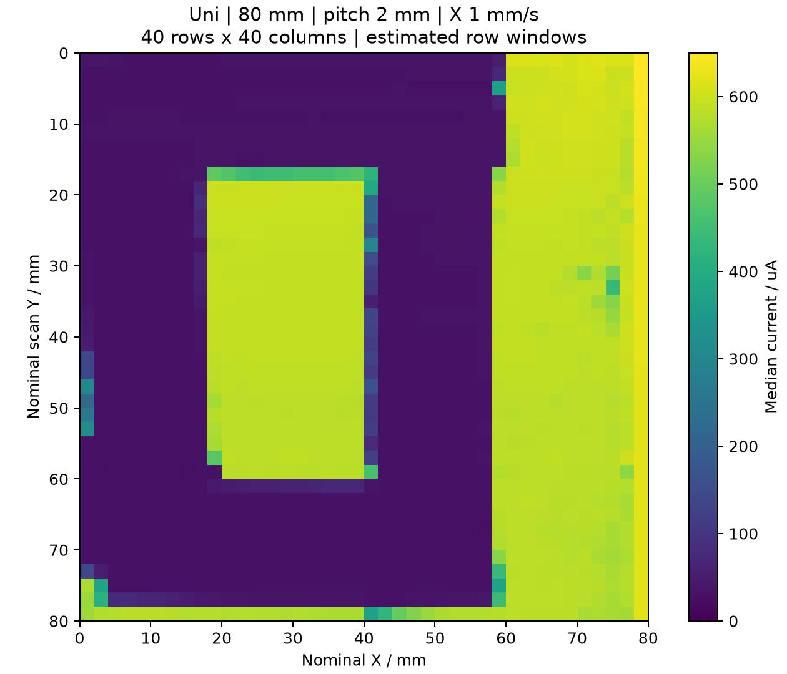
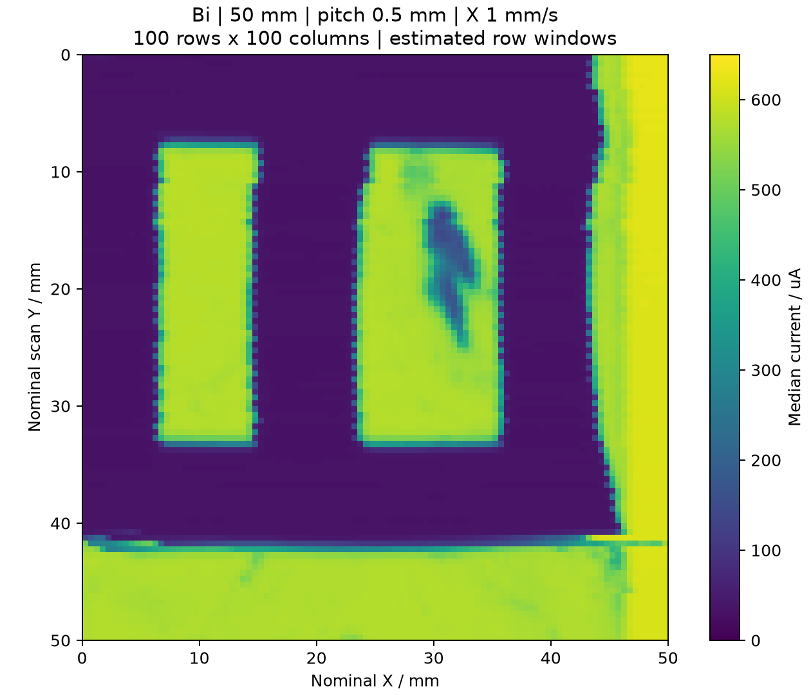
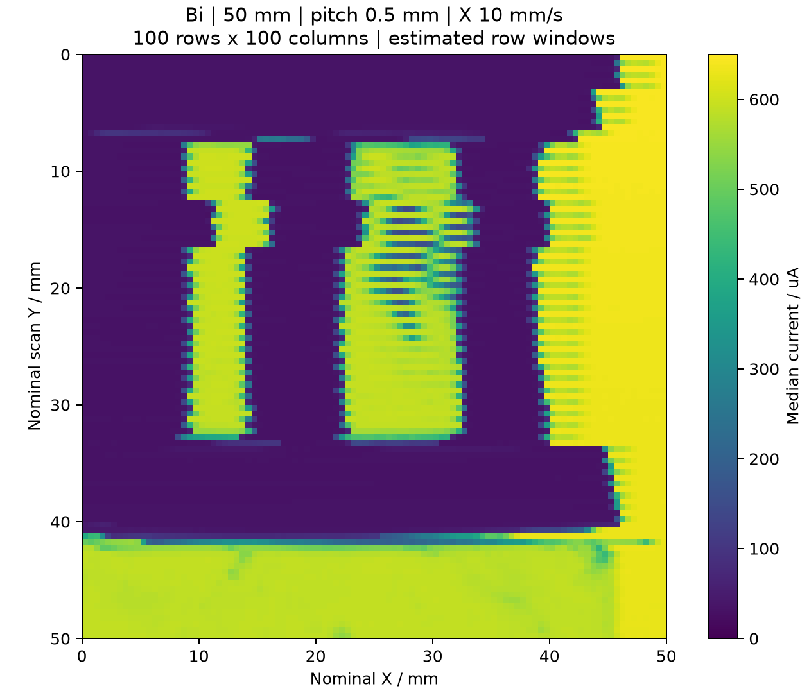
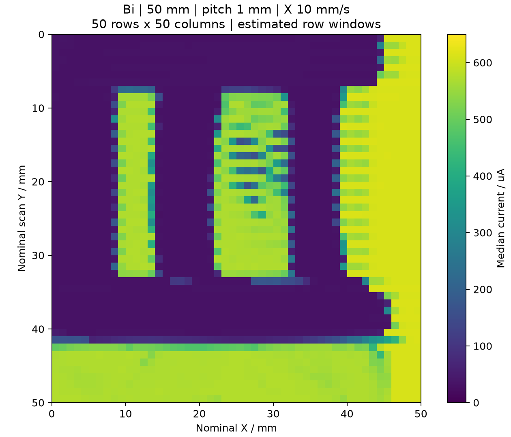
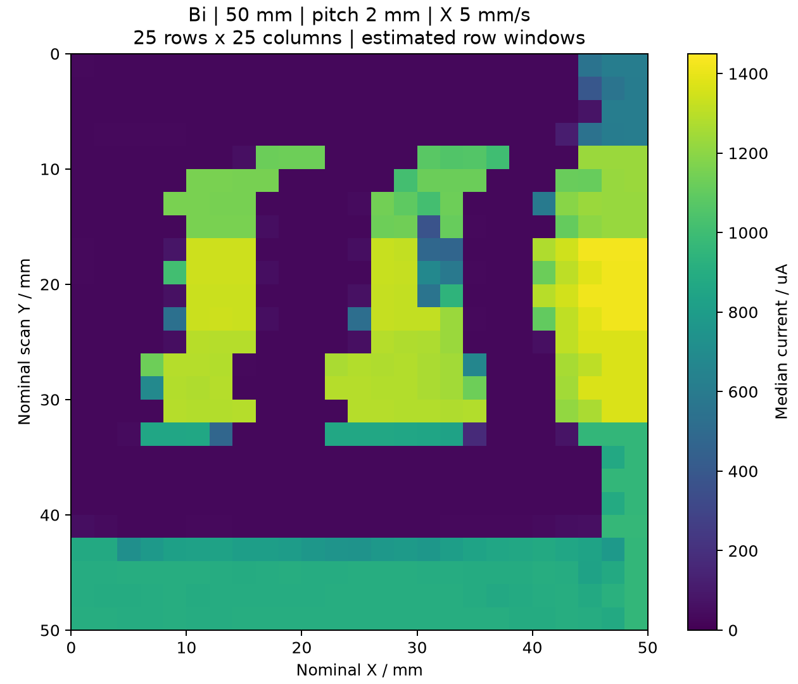

# 偏振成像演示

## 先看实验结果

**不用下载、不用运行代码：下面直接看重构图，点“原始波形”看完整采集数据。**

[全部结果：原始波形＋重构大图](RESULTS.md) · [每组一页PPT文字](experiments/2026-09-28/slide-notes.md) · [下载完整离线包](https://github.com/uestczhaoyan-gif/polarization-imaging-demo/releases/download/v3.5.0/polarization-imaging-demo-v3.5.0-complete.zip)

| 实验 | 重构预览（点击放大） | 直接打开 |
|---|---|---|
| 单向扫描 · 80×80 mm，行距2 mm，1 mm/s | [](experiments/2026-09-28/unidirectional-80mm-pitch-2mm-speed-1mmps/results/02_current_reconstruction.png) | [原始波形](experiments/2026-09-28/unidirectional-80mm-pitch-2mm-speed-1mmps/results/01_raw_I_point.png) · [设置与解读](experiments/2026-09-28/unidirectional-80mm-pitch-2mm-speed-1mmps/README.md) |
| 双向慢速 · 50×50 mm，行距0.5 mm，1 mm/s | [](experiments/2026-09-28/bidirectional-50mm-pitch-0p5mm-speed-1mmps/results/02_current_reconstruction.png) | [原始波形](experiments/2026-09-28/bidirectional-50mm-pitch-0p5mm-speed-1mmps/results/01_raw_I_point.png) · [设置与解读](experiments/2026-09-28/bidirectional-50mm-pitch-0p5mm-speed-1mmps/README.md) |
| 双向快速 · 50×50 mm，行距0.5 mm，10 mm/s | [](experiments/2026-09-28/bidirectional-50mm-pitch-0p5mm-speed-10mmps/results/02_current_reconstruction.png) | [原始波形](experiments/2026-09-28/bidirectional-50mm-pitch-0p5mm-speed-10mmps/results/01_raw_I_point.png) · [设置与解读](experiments/2026-09-28/bidirectional-50mm-pitch-0p5mm-speed-10mmps/README.md) |
| 双向快速 · 50×50 mm，行距1 mm，10 mm/s | [](experiments/2026-09-28/bidirectional-50mm-pitch-1mm-speed-10mmps/results/02_current_reconstruction.png) | [原始波形](experiments/2026-09-28/bidirectional-50mm-pitch-1mm-speed-10mmps/results/01_raw_I_point.png) · [设置与解读](experiments/2026-09-28/bidirectional-50mm-pitch-1mm-speed-10mmps/README.md) |
| 光强梯度 · 50×50 mm，行距2 mm，5 mm/s | [](experiments/2026-09-28/intensity-steps-50mm-pitch-2mm-speed-5mmps/results/02_current_reconstruction.png) | [原始波形](experiments/2026-09-28/intensity-steps-50mm-pitch-2mm-speed-5mmps/results/01_raw_I_point.png) · [设置与解读](experiments/2026-09-28/intensity-steps-50mm-pitch-2mm-speed-5mmps/README.md) |

**交互图怎么开：**下载完整包并解压，双击 `experiments/2026-09-28/index.html`。GitHub网页里的 `.html` 显示源码，不能直接交互。以上为连续电流图，行窗口仍是估计值。

支持双向蛇形与单向扫描，可在START.cmd工作台切换。单向每行横扫后返回，再Y换行（最后一行也一样）；返回段不用于成像。可选 USART3 运动日志；源表仍独立采集，后处理对齐不等于硬件同步。[模式、时间与重构说明](docs/hardware/scan-modes.md)

**中文** | [English](README.en.md)

STM32 控制双轴平移台做蛇形扫描，源表记录电流，Python 将采样重构为二维图像。项目包含固件、图形化参数编辑器、多组实测案例和可逐像素反查原始数据的离线查看器。

目前实现单通道电流空间成像；源表仍由仪器软件采集，没有电机—源表同步触发，也不计算 Stokes 参数或偏振度。

## 0928新增实验与独立轴速度

[五组成像实验、原始波形与连续色标图集](experiments/2026-09-28/README.md) · [每组一页PPT文字](experiments/2026-09-28/slide-notes.md) · [X/Y独立速度操作](docs/hardware/independent-axis-speeds.md)。原始数据与可追溯像素对应均公开；运动参数原始测试目录未上传。

## 从这里开始

下载 [完整项目包](https://github.com/uestczhaoyan-gif/polarization-imaging-demo/releases/latest)，解压后：

1. **修改电机参数**：双击主启动入口 `START.cmd`。填写范围、速度和方向（支持0.5、0.1 mm等小数行距），检查预览后保存，再到 Keil 编译、下载。[界面使用说明](docs/hardware/configuration-ui.md)
2. **查看测量结果**：在工作台“实验与使用指南”页选择案例，打开交互结果；也可直接打开下表中的 `viewer.html`。查看结果不需要 Python。
3. **开始新测量**：先读 [接线与首次运行](docs/hardware/wiring-and-first-run.md) 和 [测量记录清单](docs/reconstruction/measurement.md)，保留实际参数、时间戳与逐行运动记录。
4. **理解或修改重构**：先看 [核心处理过程](docs/reconstruction/core-process.md)，再运行下面的示例。

工作台需要 Python 3.10+（含 Tkinter），不需要安装第三方库；macOS/Linux 运行 `python tools/control_panel.py`。GitHub 不能直接执行交互 HTML，请下载后打开。

## 三组可直接准备的实验

工作台“实验与使用指南”提供三个独立入口，也可进入 [labs 实验说明](labs/README.md)：

1. [单向/双向扫描对照](labs/01_scan_modes/README.md)：切换扫描路径，生成独立工程。
2. [运动事件与相对时间](labs/02_motion_timing/README.md)：STM32→电脑事件日志、人工时间锚点、逐行窗口导出。
3. [位移与平稳速度测试](labs/03_stage_characterization/README.md)：最小有效位移、最低/最高平稳速度自动分档，默认离线运行，生成并分析实测表。

每组都有 `settings.json`、可视化入口和独立工程生成器。发布页另附三个独立源码包。日志使用 USART3 PB10/PB11 和外接 **3.3 V USB-TTL**，需要 `pyserial`；不能直接占用正在控制电机的板载 USART1。所有代码均需按说明编译烧录后进行实机验证。

## 两个实测案例

| 案例 | 数据、配置与说明 | 已保存结果 |
|---|---|---|
| 胶带 Z 字母 · 环境光 | [tape-z](experiments/tape-z/README.md)：120,311点，缺少同步记录 | [交互图](experiments/tape-z/results/viewer.html) · [重构图](experiments/tape-z/results/02_reconstruction.png) |
| 矩形胶带框 · 暗环境 | [tape-frame](experiments/tape-frame/README.md)：20,059点，80×80 mm | [交互图](experiments/tape-frame/results/anchored/viewer.html) · [照片与对应说明](experiments/tape-frame/photo-comparison.md) |

两个文件夹地位相同：各自保留原始数据、参数、实验说明和 `results/`。另有 [合成验证案例](experiments/synthetic/README.md)，用于核对算法，不属于实测数据。

## 项目目录

```text
START.cmd                 Windows 统一工作台入口
firmware/                 STM32 固件与四个 Keil 工程
tools/                    参数界面、日志、时钟映射、平台实测分析
labs/                     三组独立实验入口、参数与操作说明
reconstruction/           Python 重构代码与测试
experiments/
  tape-z/                 Z 字母：数据、配置、说明、结果
  tape-frame/             矩形框：数据、配置、照片、结果
  synthetic/              已知答案的合成验证
  manifest.sha256         全部已发布结果的校验清单
docs/                     硬件、重构、模板与项目维护文档
scripts/                  维护者检查与发布工具
local/                    本地配置备份和新生成结果（不上传）
```

所有文档从 [文档目录](docs/README.md) 进入；文件命名和历史目录对应见 [目录规范](docs/project/layout.md)。固件内部保留 Keil/CubeMX 的标准目录与工程名称。

## 运行重构

以下命令均在项目根目录执行：

```bash
python -m pip install -r reconstruction/requirements.txt
python reconstruction/simple_reconstruct.py --config experiments/tape-frame/config.json
python reconstruction/reconstruct.py run --config experiments/tape-z/config.json --open
```

新结果写入 `local/reconstruction/<案例>/`；发布快照仍保留在各案例 `results/`。完整入口默认拒绝覆盖已有输出，确需重算时加 `--overwrite`。自己的实验先复制配置并填写本次记录，不能沿用案例估计的点数周期。[重构模块说明](reconstruction/README.md)

## 固件和验证边界

控制器为 STM32F103C8T6，ZDT X42S 双轴电机；X地址2、Y地址1。仓库默认100×100 mm、行距2 mm、速度1 mm/s。工作台编辑 [snake_scan_config.h](firmware/Core/Inc/snake_scan_config.h)，保存配置不等于已烧录。四个 Keil 工程按通信检查、1 mm测试、10 mm测试、正式扫描依次使用。[固件说明](firmware/README.md)

已报告的快速横移和复位异常尚未定位。小数行距版本增加了接收确认、名义运动时间和连续到位状态检查；主机模拟通过不代表实机异常已解决。[运动异常](docs/hardware/motion-anomalies.md) · [复位与商家排查](docs/hardware/reset-and-vendor-checklist.md)

没有位置日志的实测图使用估计分行，未按照片补画。软件检查不替代烧录、接线和实际运动验证。项目没有机械回零、硬件限位或急停输入，首次运行请按硬件指南检查行程与断电手段。

维护检查：`python scripts/check_project.py`、`python scripts/run_tests.py`。

自有代码见 [LICENSE](LICENSE) 与 [重构许可](reconstruction/LICENSE)；保留 [第三方声明](docs/project/third-party-notices.md)。两个原项目的历史均已合并，后续统一在本仓库维护。[更新记录](docs/project/changelog.md)
