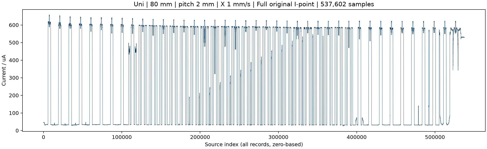
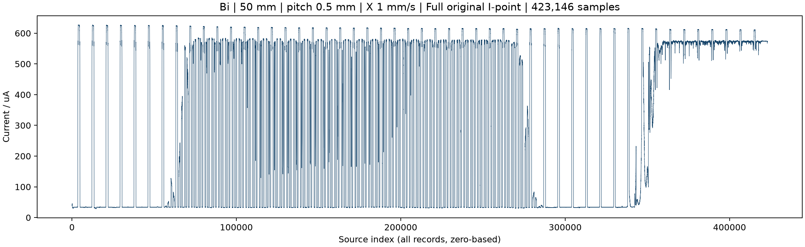
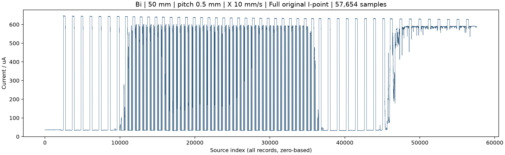
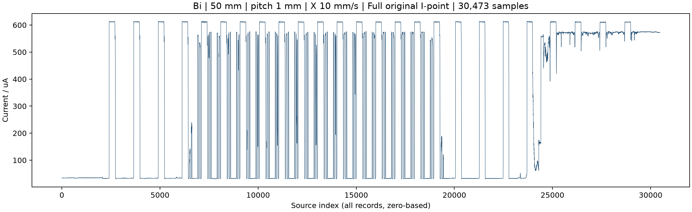
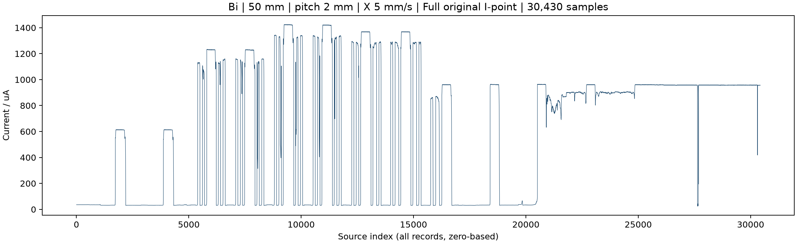

# 实验结果总览 / Experiment results

这里直接展示完整原始波形与连续电流重构，不需要安装软件。每组的设置、结果解读和数据放在同一入口。重构图使用电流中位数连续色标，无阈值化；行窗口由电流结构估计，未完成位置同步标定。

[返回项目首页](README.md) · [PPT汇报文字](experiments/2026-09-28/slide-notes.md)

## 1. 单向扫描 · 80×80 mm，行距2 mm，1 mm/s

[设置与结果解读](experiments/2026-09-28/unidirectional-80mm-pitch-2mm-speed-1mmps/README.md) · [原始数据](experiments/2026-09-28/unidirectional-80mm-pitch-2mm-speed-1mmps/raw/current.xls) · [重构参数](experiments/2026-09-28/unidirectional-80mm-pitch-2mm-speed-1mmps/config.json) · [像素对应表](experiments/2026-09-28/unidirectional-80mm-pitch-2mm-speed-1mmps/results/pixel_to_points.csv)

**完整原始波形 / Full raw trace**

**连续电流重构 / Continuous-current reconstruction**

## 2. 双向慢速 · 50×50 mm，行距0.5 mm，1 mm/s

[设置与结果解读](experiments/2026-09-28/bidirectional-50mm-pitch-0p5mm-speed-1mmps/README.md) · [原始数据](experiments/2026-09-28/bidirectional-50mm-pitch-0p5mm-speed-1mmps/raw/current.xls) · [重构参数](experiments/2026-09-28/bidirectional-50mm-pitch-0p5mm-speed-1mmps/config.json) · [像素对应表](experiments/2026-09-28/bidirectional-50mm-pitch-0p5mm-speed-1mmps/results/pixel_to_points.csv)

**完整原始波形 / Full raw trace**

**连续电流重构 / Continuous-current reconstruction**

## 3. 双向快速 · 50×50 mm，行距0.5 mm，10 mm/s

[设置与结果解读](experiments/2026-09-28/bidirectional-50mm-pitch-0p5mm-speed-10mmps/README.md) · [原始数据](experiments/2026-09-28/bidirectional-50mm-pitch-0p5mm-speed-10mmps/raw/current.xls) · [重构参数](experiments/2026-09-28/bidirectional-50mm-pitch-0p5mm-speed-10mmps/config.json) · [像素对应表](experiments/2026-09-28/bidirectional-50mm-pitch-0p5mm-speed-10mmps/results/pixel_to_points.csv)

**完整原始波形 / Full raw trace**

**连续电流重构 / Continuous-current reconstruction**

## 4. 双向快速 · 50×50 mm，行距1 mm，10 mm/s

[设置与结果解读](experiments/2026-09-28/bidirectional-50mm-pitch-1mm-speed-10mmps/README.md) · [原始数据](experiments/2026-09-28/bidirectional-50mm-pitch-1mm-speed-10mmps/raw/current.xls) · [重构参数](experiments/2026-09-28/bidirectional-50mm-pitch-1mm-speed-10mmps/config.json) · [像素对应表](experiments/2026-09-28/bidirectional-50mm-pitch-1mm-speed-10mmps/results/pixel_to_points.csv)

**完整原始波形 / Full raw trace**

**连续电流重构 / Continuous-current reconstruction**

## 5. 光强梯度 · 50×50 mm，行距2 mm，5 mm/s

[设置与结果解读](experiments/2026-09-28/intensity-steps-50mm-pitch-2mm-speed-5mmps/README.md) · [原始数据](experiments/2026-09-28/intensity-steps-50mm-pitch-2mm-speed-5mmps/raw/current.xls) · [重构参数](experiments/2026-09-28/intensity-steps-50mm-pitch-2mm-speed-5mmps/config.json) · [像素对应表](experiments/2026-09-28/intensity-steps-50mm-pitch-2mm-speed-5mmps/results/pixel_to_points.csv)

**完整原始波形 / Full raw trace**

**连续电流重构 / Continuous-current reconstruction**

## 早期实验

- [胶带Z字母：数据、说明和结果](experiments/tape-z/README.md)
- [矩形胶带框：数据、说明和结果](experiments/tape-frame/README.md)

## 离线交互查看

[下载完整项目包](https://github.com/uestczhaoyan-gif/polarization-imaging-demo/releases/download/v3.5.0/polarization-imaging-demo-v3.5.0-complete.zip)并解压，打开 `experiments/2026-09-28/index.html`。每组都有“打开像素与原始数据交互图”入口。点击像素看采样点，也可点击曲线反查像素。
