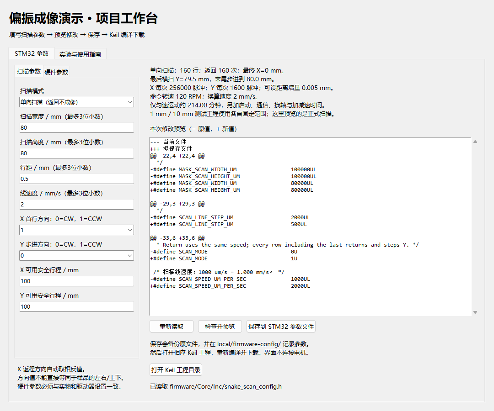

# STM32 参数配置界面

在“扫描模式”下拉框选择“双向蛇形”或“单向扫描”，预览显示模式、返回次数、最终X位置和相应运动时间。保存后重新编译下载。[完整路径与重构要求](scan-modes.md)。旧版没有SCAN_MODE的头文件需要在新版重新输入参数，不能直接覆盖。

双击根目录 `START.cmd`，或从项目根目录运行 `python tools/control_panel.py`。需要Python 3.10或更新版本及Tkinter。界面只用标准库；安装Python时保留Tcl/Tk组件，不需要先安装重构依赖。

Windows启动器会寻找已有Python；找不到时弹出文件选择框，请选择已安装的 `python.exe`（例如Anaconda安装目录里的文件）。选择会保存在本机 `local/python-path.txt`，不会上传到仓库，不要求别人使用相同安装路径。未安装Python时请先安装。

上图演示填写单向扫描、80×80 mm、行距0.5 mm、2 mm/s后的修改预览，尚未保存。界面每次实际启动都读取头文件中的当前值。

## 操作

1. 工作台启动时读取当前 `firmware/Core/Inc/snake_scan_config.h`，不自动套用历史实验参数。
2. 在“扫描参数”填写宽度、高度、行距，单位mm，最多3位小数；速度使用mm/s，最多3位小数。例如行距0.5 mm会写成500 μm。例如2 mm/s会写成2000 μm/s。选择X首行方向和Y步进方向，X返程自动设成相反值。
3. “硬件参数”允许修改电机地址、整步数、细分、导程、加速度值和启动倒计时。它们必须与机械结构和驱动器菜单一致。界面写宏定义，不会给电机设置地址或细分。
4. 点击“检查并预览”。右侧显示逐行差异、正式扫描行数、最后横扫位置、最终停点、命令转速、X/Y脉冲数、可设距离增量和理想运动时长。运动时长不包含启动、通信、换轴与加减速，不能代替源表时间记录。
5. 点击“保存到STM32参数文件”。仅替换允许编辑的宏数值，保留注释、自动计算、其他配置及换行格式。原文件备份和JSON记录保存在 `local/firmware-config/`。
6. 打开Keil工程目录，按需要选择通信检查、1 mm测试、10 mm测试或正式扫描，执行Rebuild和Download。**保存成功不代表已编译、已烧录或正在使用该配置。**

界面将检查：非数字/超出小数精度的输入、高度与行距整除、安全行程、轴地址重复、相反X方向、整数脉冲换算、32位换算/脉冲溢出及1～3000 RPM命令范围。如果文件在编辑期间被其他程序修改，会拒绝覆盖并要求重新读取。

扫描范围只决定正式工程；1 mm和10 mm测试工程有固定范围。所有工程仍共用速度和机械参数。安全行程字段只是用户填写的约束，不会检测真实机械限位。方向0/1表示驱动器CW/CCW，不能自动判断装配后的左右或上下。

## 保存和恢复

每次有实际改动的保存会产生同一UTC时间戳的 `.before.h` 备份与 `.json` 记录。JSON保存修改后参数、换算信息和前后SHA256，`flashed=false` 表示仅保存源文件。准备测量时还需记录实际烧录的固件、时间和配置。

v3.1起距离宏从 `_MM` 改为 `_UM`，数值放大1000倍。旧版本的备份不要直接覆盖新头文件；在新版界面重新输入原来的毫米值，或恢复与备份匹配的完整旧版。新界面遇到旧格式会报错并拒绝改写。

同版本恢复时，先保存当前需要保留的修改，再把选中的 `.before.h` 复制回 `firmware/Core/Inc/snake_scan_config.h`，在界面重新读取并检查；恢复源代码后仍需重新编译、下载。不要根据备份文件名判断板上当前运行版本。

一次性地址设置、清零内部位置计数、通信时序及阶段宏仍在头文件中手工维护，避免混入常规扫描操作。清零位置计数不是机械回零。已报告的运动故障见 [排查说明](motion-anomalies.md)，小行距配套的到位等待逻辑及应答模式要求见[参数边界与到位判断](scan-parameters.md#11-参数边界与到位判断)，这次修改不证明快速横移的根因已解决。

## 代码入口

- [control_panel.py](../../tools/control_panel.py)：界面与实验导航。
- [config_model.py](../../tools/config_model.py)：独立参数校验、最小文本修改、备份与保存。
- [参数测试](../../tools/tests/test_config_model.py)：参数边界、外部修改冲突、备份和文件保真。
