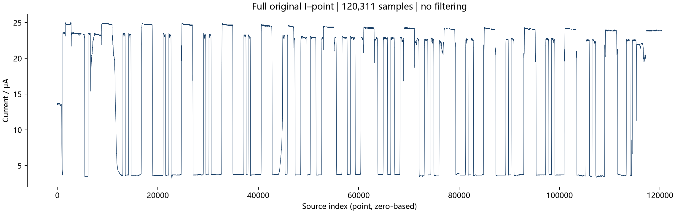
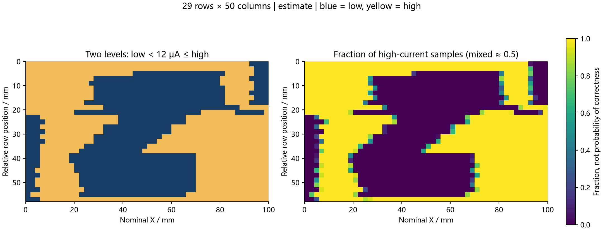

# 胶带 Z 字母 · 环境光测量

玻璃上的不透光胶带构成 Z 字母，同时存在 I/导轨遮挡。实验未关闭环境光，未记录实际行数、逐点时间戳或行同步。本例保存120,311个原始采样，当前估计图为29×50像素。

## 查看





[交互图](results/viewer.html) · [不规则像素与估计边界](../../docs/reconstruction/artifacts.md)

## 文件

| 路径 | 用途 |
|---|---|
| [data/raw_data.txt](data/raw_data.txt) | 原始源表导出，保留原始点号与电流 |
| [config.json](config.json) | 本例重构配置；输出到 `local/reconstruction/tape-z/` |
| [analyze.py](analyze.py) | 阈值、周期和换行比例敏感性分析 |
| `results/` | 完整原始图、二维图、交互网页和对应表 |
| `reference/` | 早期像素对应、启动段与重构解释图 |

从项目根目录运行：

```bash
python reconstruction/reconstruct.py run --config experiments/tape-z/config.json --open
```

用户报告宽约100 mm、高约70 mm、行距2 mm、速度2 mm/s，等待约10秒后运动。行边界由周期与相邻行一致性估计，不是真实位置日志。阈值固定12 μA；每像素约77或78点。示例不按照片重画，不应将估计坐标作为精密尺寸测量。
