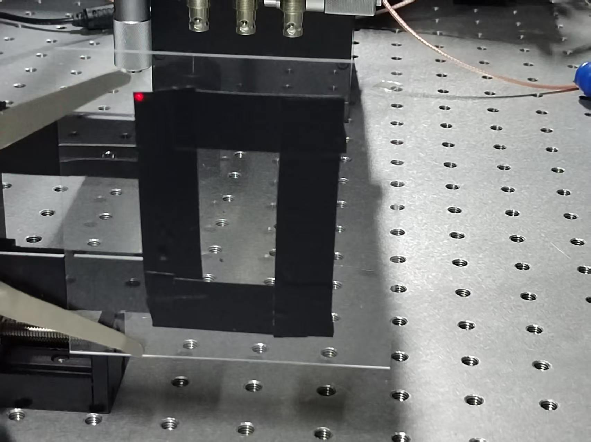
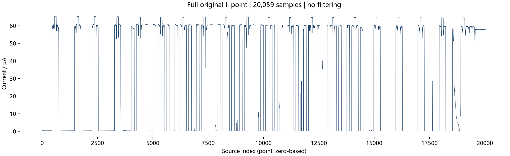
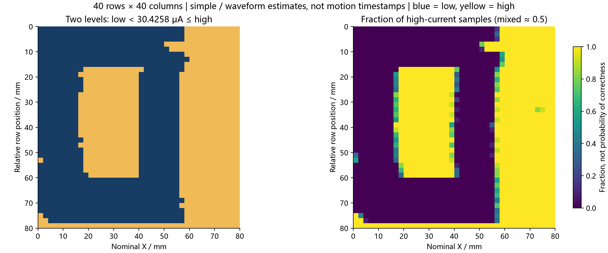

# 本次实物、原始曲线与二维图怎么对应

这次样品是**矩形胶带框**，中央留有透光窗口。照片中的红光点位于胶带外框左上角，与用户记录的初始挡光位置相符。本例和此前的 Z 字母实验分别保存。

## 先看实物和完整原始数据

照片保留原文件，没有裁剪、透视校正或重画。拍摄照片时的环境亮度不能代表采集时的光照；本次测量条件按实验者记录为暗环境。

横轴是文件中的记录顺序，不是秒。文件没有每点时间戳，因此只能准确展示 I–point；12.8秒等待和约28分40秒扫描时长不能把每个点转换成真实采样时刻。

## 再看重构的空间结构

左图蓝色为低电流、黄色为高电流。右图表示一个像素内高电流采样所占比例，**不是该像素位置正确的概率**。下表是整体形状比对，坐标均来自估计的扫描模型，不能当作胶带尺寸测量。

| 照片中的区域 | 重构中可对应的结构 | 解释范围 |
|---|---|---|
| 红光点所在的左上胶带 | 左上蓝色区域 | 与初始挡光相符；不能据此确定第一个有效采样下标 |
| 中央透光窗口 | 约 X=18–40 mm、Y=18–60 mm 的黄色长窗 | 整体形状相符，边缘的毫米坐标仍受分行和速度假设影响 |
| 窗口四周黑色胶带 | 中央窗口周围的蓝色边框 | 宽窄不完全一致也可能来自实物倾斜、光斑和时序误差 |
| 外框右侧的透光区域 | 约 X=58–80 mm 的右侧黄色区域 | 扫描范围覆盖胶带外部的解释与照片相容 |
| 外框下缘及其外部 | 底部黄色细带 | 可能扫出外框；末行窗口使用外推，暂不能精确确认下边缘位置 |

照片有透视，胶带边缘也并非完全平直。当前坐标约定左上为起点、首行向右、后续行向下；平台移动方向和光斑相对样品的方向可能相反，仍应保存实际运动箭头与轴方向。照片没有标定长度，也没有逐行轨迹，不能独立验证80 mm量程或每个像素的位置。

## 用互动图逐点检查

下载完整项目，双击根目录 `open_latest_results.cmd`，或用浏览器打开 [viewer.html](../../results/dark_80mm_20260909/anchored/viewer.html)。照片可在旁边打开作外观参考；互动图负责电流数据与二维像素的双向定位。

1. 点击中央黄色窗口，查看该像素对应的原始采样区间和电流统计。一个像素是多个采样的聚合结果，本例每个像素有9–12个采样。
2. 点击蓝黄交界，比较原始电流是否在该区间内跳变；右侧高电流占比接近0.5表示该像素混有两种状态。
3. 点击原始曲线反查行列。等待、换行或其他未用于图像的点仍被保留，映射标为未使用。
4. 对照 [固定周期图](../../results/dark_80mm_20260909/uniform/02_reconstruction.png) 和 [分行敏感性图](../../results/dark_80mm_20260909/03_timing_sensitivity.png)，判断边缘是否随分行假设显著变化。

可直接核对的例子：在 [pixel_to_points.csv](../../results/dark_80mm_20260909/anchored/pixel_to_points.csv) 中，`row=20, col=15`（下标从0开始）对应名义 X=31 mm、扫描线 Y=40 mm。它使用源数组下标 **9948至9958，共11点**，中位电流约60.411 μA，全部超过约30.426 μA阈值，所以为黄色。CSV中的 `stop_source_index_exclusive=9959` 不包含在区间内。这些十进制数组下标不要与原文件的八进制点号混用。

下一行 `row=21, col=15` 位于 X=31 mm、Y=42 mm，使用下标10532至10542。蛇形扫描时这一行从右往左走，因此重构要反转空间列顺序；原始文件中的采集顺序保持不变。完整反查见 [sample_to_pixel.csv](../../results/dark_80mm_20260909/anchored/sample_to_pixel.csv)。

## 不规则像素能说明什么

- **边缘的小台阶或混合像素**：2 mm行距、每行40列的有限网格会产生阶梯；倾斜胶带、有限光斑、探测器响应时间和积分平均会把边界过渡分散到相邻像素。缺少光斑和响应标定，不能分别量化贡献。
- **奇偶行错位或局部凸起**：分行相位和换行区间是估计值；真实运动若突然加快，等采样数就不再等距离。平台间隔异常跨越估计第4、5行，但这不是快速运动时刻的直接记录。
- **少数内部异常点**：可能来自电流波动、遮挡、通信/采样节奏或错误位置分配。只凭二值图无法唯一归因；先看对应原始片段，不能一律当噪声删除。

照片支持了整体矩形结构，但没有证明行内匀速，也不能修复未知速度轨迹。本次补充照片时，重构算法、阈值、全部54个已发布结果文件以及固件运行代码保持原样；没有按照片调出更规整的轮廓。下一次请按 [测量记录清单](../../docs/measurement.md) 保存时间戳、实际烧录配置、逐行运动事件以及异常时刻。运动与复位故障的证据和排查步骤见 [二次核查](../../../docs/复位与商家排查.md)。

原照片文件名：`88337ad5db1ac17278f75fec975d3007.jpg`。SHA256：`f43f66d9e358119c71042afb4b31862313b19faaafe9d1c65e59935d2f332b67`。
